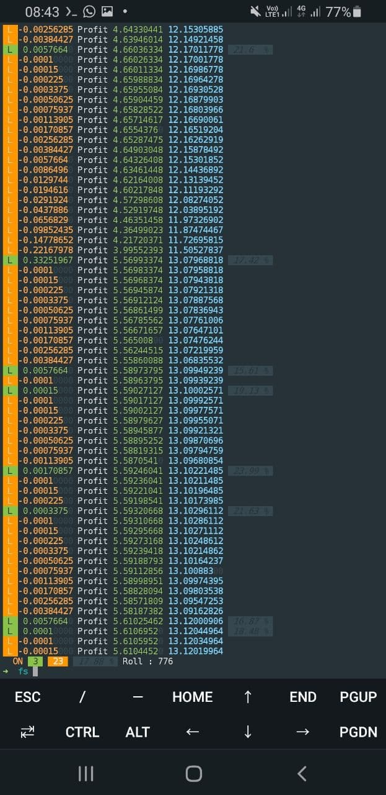

# 999dice Premium Script From FS Tutorial

This Script To Make You Rich In A Short Time, But You Need Guidance From The Creator Of This Script So You Are Not Auto Poor.

An Dice Mining Script For [999DICE]( https://www.999dice.com/?396497691 )

<p align="center">
  
</p>

## Get Started

### Linux
```
sudo apt update
```
```
sudo apt upgrade
```
```
sudo apt install python python3-pip curl -y
```
```
pip3 install colorama
```
```
pip3 install requests
```
```
pip3 install bs4
```
```
git clone https://github.com/febripranata/999dice
```
```
cd 999dice
```
```
chmod +x fs.py
```
```
python3 fs.py
```

### Termux
```
pkg update
```
```
pkg upgrade
```
```
pkg install git python python-pip curl -y
```
```
pip3 install colorama
```
```
pip3 install requests
```
```
pip3 install bs4
```
```
git clone https://github.com/febripranata/999dice
```
```
cd 999dice
```
```
python3 fs.py
```
## Configuration
```
config.json
```
```
{
  "Account"  : { "Username"  : "xxxxx",
                 "Password"  : "xxxxx"
},
  "Interface":
{               "Base Bet"   : "0.01",
                "Max Bet"    : "OFF",
                "Chance"     : "49.95",
  "Random"   :{ "Auto"       : "ON",
                "Min"        : "15",
                "Max"        : "25"
},
  "Cl_Seed"  :{ "Auto"       : "ON",
                "Every_Lose" : "2"
}
},
  "BetSet"   :{ "Bet"        : "L",
  "H / L"    :{ "Auto"       : "OFF",
                "On Lose"    : "1",
                "On Win"     : "1"
}
},
  "Increase" :{ "After Win"  : "1",
                "After Lose" : "1.5"
},
  "Reset"    :{ "If_Win"     : "1",
                "If_Lose"    : "0"
},
  "Stop"     :{ "Balance"    : "5000",
                "If_Lose"    : "0",
                "If_Prof"    : "500"
},
  "Withdraw" :{ "Auto"       : "ON",
                "Initial"    : "50",
                "Trigger"    : "300",
                "Wallet"     : "DEwmjBKxS1NvLCTYufkcCVfqW8VjWhaYY8"
}
}

```
## Contact
[Telegram]( https://t.me/joinchat/SbAwN3IkaIRQ5TtG )

Donations for continued support of this script are welcomed at:

* DOGE ( DEwmjBKxS1NvLCTYufkcCVfqW8VjWhaYY8 )
